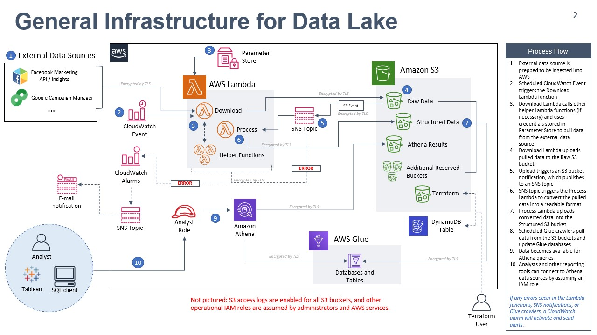

# Overview of Scripts for Data Lake

This repository contains scripts created by Slalom to automate the data pipeline and the deployment of the AWS infrastructure supporting the data lake. The Infrastructure-as-Code tool selected is Terraform and the data pipeline components are written in Python.

The code is organized in directories in the followwing manner:

```
    ├───role_creation               - IAM roles for different teams (step 1)
    ├───zone_buckets                - s3 buckets for data zones     (step 2)
    ├───infrastructure              - data-lake terraform scripts   (step 3)
    │   └───modules
    │       ├───cloudtrail            = S3 access logging CloudTrail trail
    │       ├───event-rule            = cron job periodically trigger monitor lambda
    │       ├───glue                  = glue crawlers
    │       ├───lambda                = lambda functions
    │       ├───metric-alarm          = alarms
    │       ├───monitoring            = monitoring dashboard
    │       └───sns                   = sns topics to trigger other lambda functions or send alerts
    ├───lambdas                     - Python source code for various lambda functions
    └───lambda-layers               - Python libraries used by various lambda functions
```

There is a **README** in each directory which contains more details. Here is the list:

**infrastructure**<br>

- [Roles](./role_creation/README.md)<br>
- [S3 Buckets](./zone_buckets/README.md)<br>
- [Infrastructure](./infrastructure/README.md)<br>

**Modules**<br>

- [CloudTrail](./infrastructure/modules/cloudtrail/README.md)<br>
- [cron job](./infrastructure/modules/event-rule/README.md)<br>
- [glue](./infrastructure/modules/glue/README.md)<br>
- [lambda](./infrastructure/modules/lambda/README.md)<br>
- [monitoring](./infrastructure/modules/monitoring/README.md)<br>
- [alarms](./infrastructure/modules/metric-alarm/README.md)<br>
- [notifications](./infrastructure/modules/sns/README.md)<br>

**Data Lake Code**<br>

- [python source code for lambdas](./lambdas/README.md)<br>
- [python libraries](./lambda-layers/README.md)<br>
- [S3 access reporting code](./lambdas/s3_access_reporting/README.md)
- [AWS access reporting code](./lambdas/aws_access_reporting/README.md)

**Miscellaneous Scripts**<br>

- [shell scripts](./misc-scripts/README.md)<br>

## Infrastructure-as-Code

- Terraform was used to create the Data Lake resources and those scripts can deploy various environments.
- The script in the `role_creation` folder creates the necessary IAM roles to be assumed by infrastructure admins, developers, and analysts within the data lake team.
- The set of scripts in the `infrastructure` folder creates the underlying AWS infrastructure to support the data lake.

### Order of deployment

For this project, we are assuming a brand new AWS account which only has the bare minimum configuration for OKTA federation. To create an independant layer of access control for different people and services, we first deployed the `role_creation` stack. Then, to create persistent resources (i.e. the S3 buckets), we deployed the `zone_buckets` stack before deploying the `infrastructure` stack.

**To deploy everything net new:**

1. Compress the Lambda code into deployment packages by running `./compress_lambda_packages.sh` or `./compress_lambda_packages.ps1` in `./lambdas`.
2. Apply the Terraform stack in `./role_creation`.
3. Apply the Terraform stack in `./zone_buckets`.
4. Apply the Terraform stack in `./infrastructure`.

**NOTE:** If you want to tear down the entire infrastructure, destroy the Terraform stacks in the following order:

1. `infrastructure`
2. `zone_buckets`
3. `role_creation`

For more information, please review the more detailed **README** files in each subdirectory

### Security Considerations - ABAC

Attribute-based access control (ABAC) defines permissions based on attributes. In AWS, these attributes are tags. Almost all of the resources in the provided Terraform scripts come with default tag keys. ABAC is specifically leveraged for Systems Manager, Glue, and S3 in the form of an IAM policy. Example of ABAC for the Lambda role:

```
{
      "Sid": "AllowedSSMActions",
      "Effect": "Allow",
      "Action": [
        "ssm:*Parameter",
        "ssm:AddTagsToResource"
      ],
      "Resource": "*",
      "Condition": {
        "StringEqualsIfExists": {
          "ssm:ResourceTag/ProjectTeam": "datalake",
          "ssm:ResourceTag/Environment": "dev"
        }
      }
    }
```

The condition checks if the tags `ProjectTeam` and `Environment` for any parameters in SSM Parameter Store match the values `datalake` and `dev`, respectively. This prevents the Lambda function (and whoever is writing the Lambda code) from accidentally deleting or modifying parameters in SSM Parameter Store that are not related to the Data Lake Dev environment. If you are deploying this in another environment (i.e. PRD), you will need to change the `Environment` tags to `PRD` and update the Condition for the `Environment` tag.

If you do not wish to implement ABAC, you can remove the Condition block from the IAM policy.

**Locations where ABAC is used:**

- [data team role](role_creation/main.tf)
- [lambda module](infrastructure/modules/lambda/main.tf)

### What to Change Before Deploying to Production

- Update Terraform backend to use a different S3 bucket (or same S3 bucket but with a different key) or DynamoDB table dedicated to Production
- Add users who need access to the data lake to the trust relationships in the roles from `role_creation`. Example:

```
  assume_role_policy = <<EOF
{
  "Version": "2012-10-17",
  "Statement": [
    {
      "Action": "sts:AssumeRole",
      "Principal": {
        "AWS": [
          "arn:aws:sts::<AWS account ID>:assumed-role/prd-ReadOnlyUser/<Username_1>",
          "arn:aws:sts::<AWS account ID>:assumed-role/prd-ReadOnlyUser/<Username_2>"
        ]
      },
      "Effect": "Allow"
    }
  ]
}
EOF
```

- Update Environment tags on all resources to `PRD`. This can be done in [infrastructure/main.tf](infrastructure/main.tf), [zone_buckets/main.tf](zone_buckets/main.tf), and [role_creation/main.tf](role_creation/main.tf).
- Update S3 bucket names to include `prd` in [zone_buckets/main.tf](zone_buckets/main.tf).
- Update ABAC to look at `PRD` when doing a Condition check for the `Environment` tag (see "Security Considerations - ABAC" above).

## Data Pipeline / Lambda scripts

The Data Pipeline is embodied in the infrastructure as well as the python scripts. Together, they work as a whole, scheduling and triggering various activities. The overall architecture of the pipeline is below with details about how the data is handled in the **README** file in the `lambdas` directory:



### CI/CD considerations

For the current Statement-Of-Work / Change Request, a deployment pipeline (such as Continuous Integration / Continuous Delivery) was not in scope. Thus, there are some anti-patterns built into this various Lambda subprojects that need to be improved upon in future work. Current state has Terraform responsible for deployment of both the Lambda Layers and the code itself; these expect specific versions of specific deployment packages (ZIP files) to be present in specific locations. This is (...specifically) not ideal. Here are some considerations for moving towards a better development experience like CI/CD:

- Remove ZIP files from source control - deployment artifacts should be checked into an appropriate repository (such as Artifactory), not into code source control (like Git)
- Remove Terraform code for deployment of artifacts. Code deployment should be tied to the code repository and performed by the CI/CD pipelines, not by the infrastructure set up.
- Consider not having a single mono-repository for all code, splitting at least the Terraform from the Lambda and Layers code.
- As can be seen in the commit history of this project, we ran into issues with various branching strategies and defaulted to trunk-based development (all changes occur on master). Git Flow, etc. should be considered as the project matures.
- As CI/CD pipelines are built, split the Layers from the Lambda code itself. The Layers are not expected to change regularly, and thus there is no reason to regularly upload the Layers for every code change.
- Some thought should be put into Layer management as well. The AWS Data Wrangler layer is public, and needs to be tracked for bug/security fixes in some manner. The Common layer also needs to be tied to the versions of code actually in use for development; there are currently separate requirement/freeze files for the lambda code and the common layer.
- Create\_\*.bat scripts are a good starting point for CI/CD pipelines, but should be part of those repositories rather than in the source code repository.
# datalake-alsac
