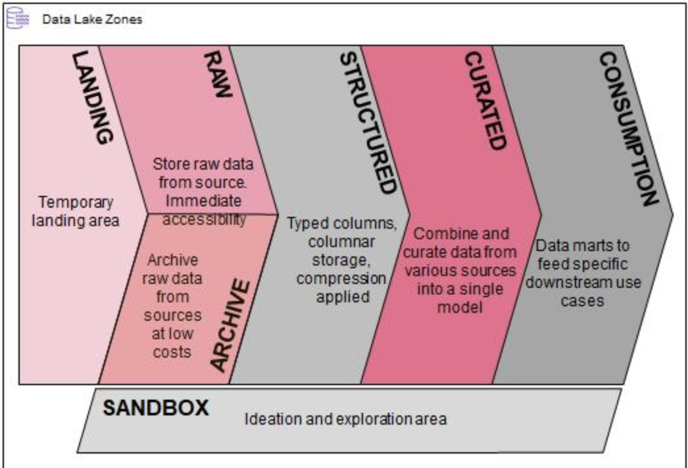

> To create net new buckets and allow Terraform to manage the buckets, you may run the script in this folder.

# S3 Buckets for Data Zones



This creates S3 buckets that are aligned with the data lake zoning standards. These S3 buckets were created in its own Terraform stack in order to be independent of the `infrastructure` scripts. In the case where the `terraform apply` or `terraform destroy` is run on the `infrastructure` stack, this ensures that the S3 buckets are not impacted if they already contain a significant amount of data. S3 bucket names must also be globally unique, so if they are included in the Terraform configuration and the Terraform stack is then destroyed and re-applied, there is no guarantee of when the S3 bucket names will become available again.

For the current iteration of the data lake, the following buckets are used:

- **Raw bucket**: Stores data downloaded from the external data source.
  - A lifecycle policy was applied to move all objects to Glacier after 365 days
- **Curated bucket**: Stores converted Parquet files from the data in the Raw bucket.
- **Logs bucket**: Stores S3 cloudtrail logs and access reports.
- **Athena bucket**: Stores Athena query results.
  - A bucket policy was also attached to the Athena bucket to restrict access to only developers and infrastructure admins.

Additional buckets were created for future use to align with the data lake zoning standards (the raw and curated buckets shown in the infrastructure diagram are also zones): landing, structured, consumption, and sandbox buckets.

A block public access policy was also applied to each S3 bucket in order to lock them down.

## Initial Setup

##### 1. Install [Terraform v0.12.24](https://www.terraform.io/downloads.html) if not already installed.

To check the version:

```bash
$ terraform --version
```

If using Linux or MacOS, you can use `tfenv`:

```bash
$ git clone https://github.com/tfutils/tfenv.git
$ cd tfenv
$ tfenv install 0.12.24
```

##### 2. Set up your AWS profile for the [AWS provider](https://www.terraform.io/docs/providers/aws/index.html).

Because Active Directory federation is already set up with your AWS account, you can use [saml2aws](https://github.com/Versent/saml2aws#install). If saml2aws is not configured yet, run the following:

```bash
$ saml2aws configure
$ ? Please choose a provider: Okta
$ ? Please choose an MFA: OKTA
$ ? AWS Profile (saml)
$ ? URL https://alsac.okta.com/home/amazon_aws/0oa1xx7rowXQhZ0nv297/272
$ ? Username <your AD username>
$ ? Password <your AD password>
$ ? Confirm <your AD password>
```

Otherwise, run:

```bash
$ saml2aws login
```

This will populate `~/.aws/credentials` with a temporary AWS access key id, secret access key, and session token.

##### 3. Assume role with enough permissions to deploy Terraform

If you are already authenticated to AWS as an administrator, you can skip to the next step.

Otherwise, if you do not have administrative access to S3, you will need to assume the infrastructure admin role that was created in `../role_creation`. Your administrator would need to add a trust relationship between the role and your AWS user.

Open `~/.aws/config` and include the following:

```
[profile alsac]
region = us-east-1
role_arn = arn:aws:iam::117183459779:role/sl_infra_team_role
source_profile = saml
```

## Inputs

| Input               | Description                                                                       | Type   | Default                            | Required? |
| ------------------- | --------------------------------------------------------------------------------- | ------ | ---------------------------------- | --------- |
| data_bucket         | Name of bucket containing the raw data                                            | string | alsac-dla-dev-raw                  | Yes       |
| curated_bucket      | Name of bucket containing the curated data                                        | string | alsac-dla-dev-curated              | Yes       |
| athena_bucket       | Name of bucket containing the Athena query results                                | string | alsac-dla-aws-athena-query-results | Yes       |
| log_bucket          | Name of bucket containing the S3 access logs from data_bucket and curated_bucket  | string | alsac-dla-dev-log                  | Yes       |
| structured_bucket   | Name of bucket for structured data zone                                           | string | alsac-dla-dev-structured           | Yes       |
| landing_bucket      | Name of bucket for landing data zone                                              | string | alsac-dla-dev-landing              | Yes       |
| consumption_bucket  | Name of bucket for consumption data zone                                          | string | alsac-dla-dev-consumption          | Yes       |
| sandbox_bucket      | Name of bucket for sandbox data zone                                              | string | alsac-dla-dev-sandbox              | Yes       |
| lifecycle_rule_name | ID of lifecycle rule for raw bucket to move old objects to Glacier after 365 days | string | archive_to_glacier                 | Yes       |

## How to Run

1. Clone this repo:

```bash
$ git clone ssh://git@bitbucket.alsac.stjude.org:7999/itse/slalom.git
```

2. Navigate to the `zone_buckets` folder.
3. Initialize the Terraform stack, create an execution plan, and verify that there are no unintended/unwanted changes or errors.

```bash
$ terraform init -backend-config <ENV>.tfvars
$ terraform plan -var-file <ENV>.tfvars
```

4. Apply the changes.

```bash
$ terraform apply -var-file <ENV>.tfvars
```

## Clean-up

If you need to tear down a Terraform stack, run the destroy command in the working directory.

```bash
$ terraform destroy -var-file <ENV>.tfvars
```
